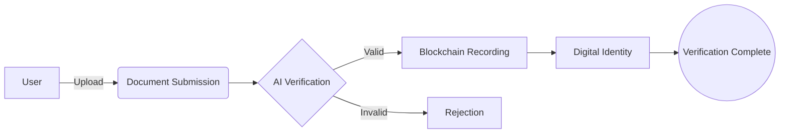

<div align="center">

<!-- Animated Project Logo -->
<picture>
  <source media="(prefers-color-scheme: light)" srcset="public/assets/logo.png">
  
</picture>

<!-- Dynamic Badges -->
[](https://project-ivs.vercel.app/)
[](https://github.com/pranaykumar2/project-ivs/commits/main)
[](LICENSE)

<!-- Tech Stack Badges -->
<p>
  
  
  
</p>

<!-- Project Description -->
<h3>
  <code>Next-Gen Identity Verification Using Blockchain</code>
</h3>

<p>
  <em>Revolutionizing identity verification with cutting-edge blockchain technology, providing secure, transparent, and instantaneous verification for the modern digital age.</em>
</p>

<!-- Quick Links -->
[Demo](https://project-ivs.vercel.app/) • [Documentation](docs/) • [Report Bug](issues/new) • [Request Feature](issues/new)

</div>

---

<!-- Project Highlights -->
## 🌟 Highlights

<table>
<tr>
<td>

### 📊 Statistics
- **Success Rate**: 99.9%
- **Active Users**: Growing
- **Reviews**: ⭐⭐⭐⭐⭐
- **Uptime**: 99.99%

</td>
<td>

### 🏆 Achievements
- Most Anticipated Project 2024
- Cutting-edge Blockchain Integration
- Advanced Security Protocols
- Real-time Verification

</td>
</tr>
</table>

---

<!-- Core Features -->
## 🚀 Core Features

<details>
<summary><b>🔐 Blockchain Verification</b></summary>

- **Smart Contracts Integration**
  ```solidity
  contract IdentityVerification {
      mapping(address => bool) public verifiedIdentities;
      event IdentityVerified(address user, uint256 timestamp);
      // ... more code
  }
  ```
- **Immutable Record Keeping**
- **Transparent Process Tracking**
</details>

<details>
<summary><b>🤖 AI-Powered Security</b></summary>

- Document Authenticity Check
- Fraud Detection Systems
- Biometric Verification
- Pattern Recognition
</details>

<details>
<summary><b>🔄 Real-time Processing</b></summary>

- Instant Verification Status
- Live Progress Tracking
- Automated Notifications
- Status Updates
</details>

---

<!-- Industry Applications -->
## 🎯 Industry Applications

| Sector | Features | Benefits |
|--------|-----------|----------|
| 🏦 **Financial** | KYC Verification<br>Fraud Prevention | Regulatory Compliance<br>Risk Reduction |
| 🏥 **Healthcare** | Patient Data Protection<br>Record Access | HIPAA Compliance<br>Instant Verification |
| 🏛️ **Government** | Citizen Services<br>Document Verification | Reduced Bureaucracy<br>Enhanced Security |

---

<!-- Architecture -->
## 🏗️ System Architecture



---

<!-- Tech Stack -->
## 💻 Technology Stack

<table>
<tr>
<td>

### Frontend


</td>
<td>

### Animation


</td>
</tr>
</table>

---

<!-- Team -->
## 👥 Team Titans

<div align="center">
<table>
<tr>
<td align="center">
<a href="https://github.com/pranaykumar2">
<br />
<sub><b>Pranay Kumar</b></sub>
</a><br />
<small>Full Stack & Blockchain</small>
</td>
<td align="center">
<a href="https://github.com/Strange3438">
<br />
<sub><b>Rahul Sai Pavan</b></sub>
</a><br />
<small>Blockchain Developer</small>
</td>
</tr>
</table>
</div>

---

<!-- Quick Start -->
## 🚀 Quick Start

1️⃣ **Clone the repository**
```bash
git clone https://github.com/pranaykumar2/project-ivs.git
```

2️⃣ **Navigate to project**
```bash
cd project-ivs
```

3️⃣ **Start development server**
```bash
# Using live server or preferred local server
live-server
```

---

<!-- Contact -->
## 📬 Connect With Us

<div align="center">

[](https://iampranay.pages.dev)
[](https://github.com/pranaykumar2)
[](https://linkedin.com/in/iamypranay)
[](mailto:ypranaykumar1002@gmail.com)

</div>

---

<!-- Footer -->
<div align="center">

### Made with 💙 and Blockchain

© 2024 Identity Verification System • [Privacy Policy](privacy) • [Terms](terms)

<details>
<summary>Show your support</summary>
<br>

⭐️ Star this project<br>
🐛 Report issues<br>
🌟 Share with others

</details>

</div>
