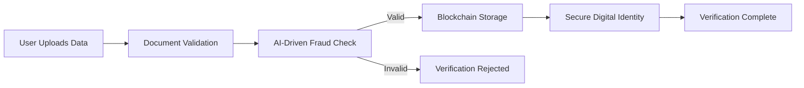

<div align="center">

<!-- Logo Section -->
<picture>
  <source media="(prefers-color-scheme: light)" srcset="public/assets/logo.png">
  
</picture>

<!-- Dynamic Status Badges -->
<p>
  <a href="https://project-ivs.vercel.app/">
    
  </a>
  <a href="https://github.com/pranaykumar2/project-ivs/commits/main">
    
  </a>
  <a href="LICENSE">
    
  </a>
</p>

<!-- Project Title and Tagline -->
<h1><code>Identity Verification System (IVS)</code></h1>
<h3><em>Redefining trust with next-generation blockchain-backed identity verification.</em></h3>

<!-- Quick Links -->
<p>
  <a href="https://project-ivs.vercel.app/" style="margin-right: 15px;">
    
  </a>
  <a href="docs/" style="margin-right: 15px;">
    
  </a>
  <a href="issues/new">
    
  </a>
</p>

</div>

---

## 🌟 **Project Highlights**

<div align="center">

| **📊 Statistics**                   | **🏆 Achievements**               |
|-------------------------------------|------------------------------------|
| **99.9% Success Rate**              | Awarded *Most Innovative Project* |
| **Growing Active Users**            | Seamless Blockchain Integration   |
| **Uptime**: 99.99%                  | Industry-Standard Security        |
| **⭐⭐⭐⭐⭐ User Reviews**              | Real-Time Verification Process    |

</div>

---

## 🚀 **Core Features**

<details>
  <summary><b>🔐 Blockchain Verification</b></summary>
  <ul>
    <li>Smart Contract Integration</li>
    <li>Immutable and Transparent Record Keeping</li>
    <li>Enhanced Fraud Protection</li>
  </ul>
</details>

<details>
  <summary><b>🤖 AI-Powered Security</b></summary>
  <ul>
    <li>Automated Document Authenticity Checks</li>
    <li>Advanced Biometric Verification</li>
    <li>Real-Time Fraud Detection</li>
  </ul>
</details>

<details>
  <summary><b>🔄 Real-Time Processing</b></summary>
  <ul>
    <li>Live Status Updates</li>
    <li>Automated Notifications</li>
    <li>Instant Verification Decisions</li>
  </ul>
</details>

---

## 🎯 **Industry Applications**

| Sector       | Features                    | Benefits                         |
|--------------|-----------------------------|----------------------------------|
| **Financial**| KYC, Anti-Fraud            | Compliance, Risk Mitigation     |
| **Healthcare**| Data Privacy, Access       | HIPAA Compliance, Security      |
| **Government**| Identity Verification      | Efficiency, Enhanced Trust      |

---

## 🏗️ **System Architecture**



---

## 💻 **Technology Stack**

### Frontend
- 
- 
- 

### Animation
- 
- 

### Backend
- Blockchain (Smart Contracts with Solidity)
- AI Verification Algorithms

---

## 👥 **Our Team**

<div align="center">

| Member              | Role                       |
|---------------------|----------------------------|
|  **Pranay Kumar** | Full Stack & Blockchain Dev |
|  **Rahul Sai Pavan** | Blockchain Specialist      |

</div>

---

## 🚀 **Quick Start**

1. **Clone the Repository**:
   ```bash
   git clone https://github.com/pranaykumar2/project-ivs.git
   ```
2. **Navigate to the Project Directory**:
   ```bash
   cd project-ivs
   ```
3. **Start Development Server**:
   ```bash
   npm start
   ```

---

## 📬 **Connect With Us**

<div align="center">

[](https://iampranay.pages.dev)
[](https://github.com/pranaykumar2)
[](https://linkedin.com/in/iamypranay)
[](mailto:ypranaykumar1002@gmail.com)

</div>

---

<div align="center">

### Made with ❤️ and Blockchain for a Secure Tomorrow

© 2025 Identity Verification System | [Privacy Policy](privacy) | [Terms](terms)

</div>
