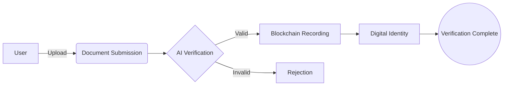

<!-- Animated Project Logo -->
<picture>
  <source media="(prefers-color-scheme: light)" srcset="public/assets/logo.png">
  
</picture>

<!-- Dynamic Badges -->

  
  
  

<!-- Project Title -->
<h1 style="font-size: 2.5rem; animation: slideInFromBottom 1.5s ease-out;">
  Next-Gen Identity Verification
</h1>

  <em>Revolutionizing identity verification with blockchain technology for secure, transparent, and instantaneous user authentication.</em>

<!-- Quick Links -->

  
  
  

---

<!-- Project Highlights -->
## 🌟 Highlights

### 📊 Statistics
- **Success Rate:** 99.9%
- **Active Users:** Growing
- **Reviews:** ⭐⭐⭐⭐⭐
- **Uptime:** 99.99%

### 🏆 Achievements
- Most Anticipated Project 2024
- Cutting-edge Blockchain Integration
- Advanced Security Protocols
- Real-time Verification

---

<!-- Core Features -->
## 🚀 Core Features

### 🔐 Blockchain Verification
- **Smart Contracts Integration**
- **Immutable Record Keeping**
- **Transparent Process Tracking**

### 🤖 AI-Powered Security
- Document Authenticity Check
- Fraud Detection Systems
- Biometric Verification
- Pattern Recognition

### 🔄 Real-time Processing
- Instant Verification Status
- Live Progress Tracking
- Automated Notifications
- Status Updates

---

<!-- Industry Applications -->
## 🎯 Industry Applications

| Sector       | Features                       | Benefits                   |
|--------------|--------------------------------|----------------------------|
| 🏦 Financial | KYC Verification, Fraud Prevention | Regulatory Compliance, Risk Reduction |
| 🏥 Healthcare| Patient Data Protection, Record Access | HIPAA Compliance, Instant Verification |
| 🏛️ Government | Citizen Services, Document Verification | Reduced Bureaucracy, Enhanced Security |

---

<!-- System Architecture -->
## 🏗️ System Architecture

---

<!-- Tech Stack -->
## 💻 Technology Stack

| Frontend      | Animation       |
|---------------|-----------------|
|  |  |
|  |  |
|  |                 |

---

<!-- Team -->
## 👥 Meet the Team

| Team Member         | Role                     |
|---------------------|--------------------------|
|  | Full Stack & Blockchain |
|  | Blockchain Developer    |

---

<!-- Contact -->
## 📬 Connect With Us

---

